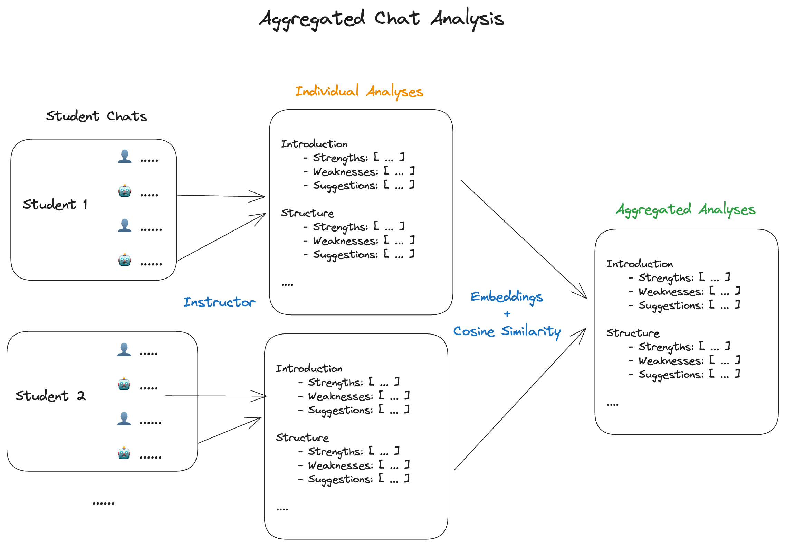

# Aggregated Chat Analysis for Personalised Teacher Assistance - Essay Feedback

As students use platforms like Khanmigo and MagicSchool.ai for tasks like getting feedback on their essays and "chat" with
the tool to improve their learning, it will quickly become difficult for teachers to keep up with the volume of chat data.

This project aims to experiment with methods to aggregate chat data to provide teachers with data to improve instruction.

For the first experiment we will focus on a tool that gives feedback on essays.

This aggregated feedback is then used to demonstrate the personalisation for a **Lesson Plan Generator Tool** that will be used by a Teacher.

[ClassroomLM](https://classroom-lm.vercel.app/) is a WIP and here is the [frontend](https://github.com/13point5/classroom-lm) repo.

## Data

I used ChatGPT to generate the student essays and follow-up chat data. I used MagicSchool.ai's tool for providing feedback on essays for the AI messages.

## Architecture



I've used a simple `Evaluation` data model to analyse **ONLY** the AI messages. I know that this approach has drawbacks but I want to keep it simple for now to see if it's remotely useful.

### Evaluation Data Model

For each of the criteria below, we extract the following data:

- `strengths`
- `weaknesses`
- `suggestions`

**Criteria**:

1. **Introduction**

   - Clarity of thesis statement
   - Engagement and relevance of opening statements

2. **Structure**

   - Organization and clarity of paragraphs
   - Logical flow of ideas

3. **Argumentation**

   - Strength and clarity of arguments
   - Use of critical reasoning

4. **Evidence**

   - Relevance and quality of evidence
   - Use of citations and references

5. **Conclusion**

   - Restatement of thesis
   - Summary of main points
   - Closing statements

## Setup

```bash
poetry install
```

## Usage

The only experiment I have is in `experiment.ipynb` which is self-explanatory.
