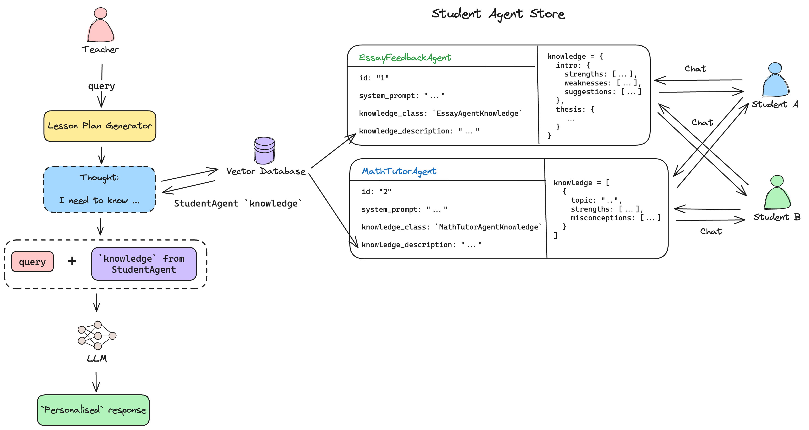

# 🤖 🤝 Multi LLM Agent Discovery, Structured Knowledge generation, and Collaboration

As students use platforms like Khanmigo and MagicSchool.ai for tasks like getting feedback on their essays and "chat" with
the tool to improve their learning, it will quickly become difficult for teachers to keep up with the volume of chat data to personalise instruction.

In this repo we experiment with ways to store and aggregate structured knowledge from LLM Agents, and for agents to discover other agents by generating a thought to personalise their output.

The [Agent Discovery](./agent-discovery-v1/agent-discovery.ipynb) notebook shows how student facing agents such as essay feedback providers can store knowledge about students that can be used by teacher facing agents such as a lesson plan generator to personalise the output.

[ClassroomLM](https://classroom-lm.vercel.app/) is a WIP that will demonstrate the use of this experiment and here is the [frontend](https://github.com/13point5/classroom-lm) repo.

## Architecture

### 1. Multi Agent Discovery and Collaboration



### 2. Knowledge Aggregation


I've used a simple `Evaluation` data model to analyse **ONLY** the AI messages. I know that this approach has drawbacks but I want to keep it simple for now to see if it's remotely useful.

## Data

I used ChatGPT to generate the student essays and follow-up chat data. I used MagicSchool.ai's tool for providing feedback on essays for the AI messages.

### Evaluation Data Model

For each of the criteria below, we extract the following data:

- `strengths`
- `weaknesses`
- `suggestions`

**Criteria**:

1. **Introduction**

   - Clarity of thesis statement
   - Engagement and relevance of opening statements

2. **Structure**

   - Organization and clarity of paragraphs
   - Logical flow of ideas

3. **Argumentation**

   - Strength and clarity of arguments
   - Use of critical reasoning

4. **Evidence**

   - Relevance and quality of evidence
   - Use of citations and references

5. **Conclusion**

   - Restatement of thesis
   - Summary of main points
   - Closing statements

## Setup

```bash
poetry install
```
